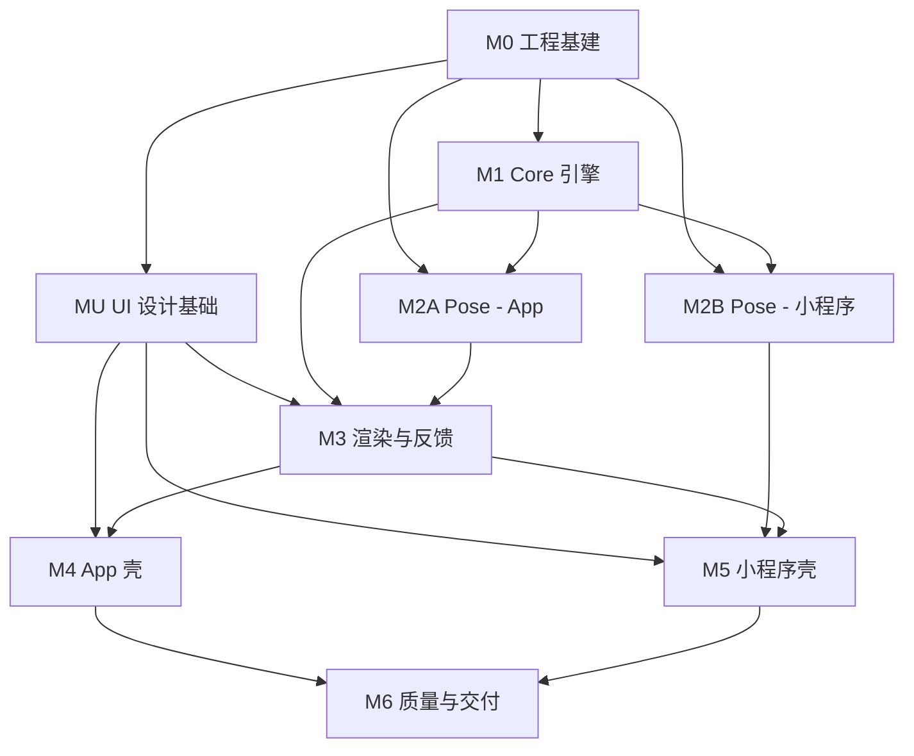

# 模块划分与开发顺序

> 不按天数排期。按**模块依赖**推进：上游模块 `done` 后，下游才能开始。  
> Loop 每次迭代完成**一个 Task**；模块内 Task 清空后跑**模块门禁**，再进入下一模块。

## 模块依赖图



---

## M0 — 工程基建（Infrastructure）

**职责**：Monorepo、工具链、Spike 验证、文档与进度文件就绪。

| Task ID | 内容 | 检验 | 人工 |
|---------|------|------|------|
| M0-T1 | pnpm workspace + 目录结构（见 PRD §7.2） | VT-P1-001 预备 | — |
| M0-T2 | Expo `apps/mobile` 可启动 | VT-P0A-001 | — |
| M0-T3 | App 摄像头预览 | VT-P0A-002 | 真机 |
| M0-T4 | App 姿态 Spike（MediaPipe/ML Kit 二选一） | VT-P0A-004~007 | 真机 |
| M0-T5 | 微信小程序工程 + camera | VT-P0B-001,002 | 微信真机 |
| M0-T6 | 小程序姿态 Spike + `spike-report.md` | VT-P0B-003~005 | 真机 |
| M0-T7 | 填写 `docs/progress.json` 模块状态机 | — | — |

**模块门禁 M0-GATE**

- [ ] App：摄像头 + 骨骼 + FPS≥15
- [ ] 小程序：至少一种 pose 方案可出点
- [ ] `docs/spike-report.md` 完成，PRD §5.3 已更新

**出口产物**：可构建的 monorepo + Spike 结论

---

## M1 — Core 引擎（平台无关）

**职责**：角度、校验、相位、计数、深蹲规则；**禁止**依赖摄像头或 UI。

**依赖**：M0-GATE

| Task ID | 内容 | 检验 |
|---------|------|------|
| M1-T1 | `packages/core/types.ts` | — |
| M1-T2 | `angles.ts` + 单测 | VT-P1-002 |
| M1-T3 | `fixtures/` 六组 FX-* 假数据 | VT-P1-010 |
| M1-T4 | `validate.ts` + 单测 | VT-P1-003 |
| M1-T5 | `phase.ts` 深蹲状态机 | VT-P1-004 |
| M1-T6 | `repCounter.ts` | VT-P1-005 |
| M1-T7 | `exercises/squat.ts` | VT-P1-006 |
| M1-T8 | 防抖 / 冷却逻辑 | VT-P1-007,008 |
| M1-T9 | 覆盖率 ≥80% | VT-P1-009 |
| M1-T10 | 可选：`tools/dev-web` 调试 validate | — |

**模块门禁 M1-GATE**

- [ ] `pnpm --filter @fitness-coach/core test` 全绿
- [ ] `squat-rules.md` ≡ `squat.ts`（契约脚本通过）
- [ ] 无需真机

**出口产物**：`packages/core` 可被任何平台 import

---

## MU — UI 设计基础（Design Foundation）

**职责**：定调性、布局、组件契约；**不写**摄像头逻辑，**不写**业务校验。

**依赖**：M0-GATE（需知平台与技术约束）  
**并行**：可与 **M1** 同时进行  
**阻塞**：**M3、M4、M5 不得在未 MU-GATE 时开始 UI 实现**

| Task ID | 内容 | 检验 | 人工 |
|---------|------|------|------|
| MU-T1 | 确认 `docs/UI.md` 线框（PG-001~005） | 产品签字或 PRD 批注 | **你确认** |
| MU-T2 | 定稿 `docs/design-tokens.md` | UI-001, UI-012 | 可选审色 |
| MU-T3 | 创建 `packages/ui` + 组件 props 类型（CMP-001~011） | 与 UI.md §4 一致 | — |
| MU-T4 | PG-004 布局分区图（安全区、反馈条、底栏） | UI-006 | — |
| MU-T5 | 平台差异说明落盘（UI.md §5） | UI-010 | — |

**模块门禁 MU-GATE**

- [x] `design-tokens.md` 非占位，有确认日期（0.2.0 / 2026-07-18）
- [x] `packages/ui` 导出组件类型 / 主题（`getTheme`）
- [x] M3/M4 可直接 import token，无需临时硬编码（2026-07-18 人工确认）

**出口产物**：视觉规范 + 组件契约（实现分布在 M3/M4/M5）

---

## M2A — Pose 适配层（App）

**职责**：`packages/pose-native` — 帧 → 平滑 landmarks。

**依赖**：M1-GATE

| Task ID | 内容 | 检验 |
|---------|------|------|
| M2A-T1 | 统一接口 `detect(frame): Landmark[]` | VT-P2-001 |
| M2A-T2 | One Euro Filter | VT-P2-003 |
| M2A-T3 | visibility 过滤 | VT-P2-004 |
| M2A-T4 | DevPoseScreen：接 core 实时校验 | VT-P2-002 |
| M2A-T5 | 分辨率自适应降级 | VT-P2-006 |
| M2A-T6 | 接 core 后 FPS 回归 | VT-P2-005 |

**模块门禁 M2A-GATE**

- [x] 真机调试页：膝角 + validation status 实时更新
- [x] FPS ≥15（接 core 后）

---

## M2B — Pose 适配层（小程序）

**职责**：`packages/pose-mp` — 按 Spike 方案实现；接口与 M2A 对齐。

**依赖**：M0-GATE、M1-GATE（可与 M2A / M3 / M4 **并行**，但 M5 前必须完成）

| Task ID | 内容 | 检验 |
|---------|------|------|
| M2B-T1 | 小程序构建接入 monorepo | VT-P5-001,002 |
| M2B-T2 | pose-mp 实现（端侧或云端） | VT-P5-003 |
| M2B-T3 | 与 core 输出 validate 结果一致（夹具级） | VT-P5-004 |

**模块门禁 M2B-GATE**

- [x] 微信真机：能出点并驱动 validate（2026-07-25：status=correct，FPS~4 记实值）
- [x] 若云端：隐私授权流程就绪（方案 A 端侧，不适用）

---

## M3 — 渲染与反馈（Render & Guidance）

**职责**：`packages/render` + 训练叠加层 UI（L2）：骨骼、颜色、ghost、FeedbackBar 数据与样式 hook。

**依赖**：M1-GATE、MU-GATE、M2A-GATE

| Task ID | 内容 | 检验 |
|---------|------|------|
| M3-T1 | 骨骼绘制数据结构 + App adapter | VT-P3A-001 |
| M3-T2 | 关节颜色编码 | VT-P3A-002 |
| M3-T3 | FeedbackBar 文案优先级 | VT-P3A-003 |
| M3-T4 | 防抖 / 冷却接反馈层 | VT-P3A-004,005 |
| M3-T5 | 站位引导逻辑 | VT-P3A-006 |
| M3-T6 | Ghost 关键帧 + 插值 | VT-P3B-001,002 |
| M3-T7 | Rep 计数状态接 UI 数据 | VT-P3B-003,004 |

**模块门禁 M3-GATE**

- [ ] App 上：M1 场景（纠错）可通过 — VT-P3A-M1
- [ ] Ghost 在 App 调试/训练页可见

---

## M4 — App 应用壳（Mobile Shell）

**职责**：`apps/mobile` 页面流、会话、总结；组装 M2A + M3 + M1。

**依赖**：M3-GATE、**MU-GATE**

| Task ID | 内容 | 检验 |
|---------|------|------|
| M4-T1 | PG-001 动作库（仅深蹲卡片） | FR-001 |
| M4-T2 | PG-002 动作详情 + 机位说明 | FR-002 |
| M4-T3 | PG-003 准备页 + 倒计时 | FR-070, FR-022 |
| M4-T4 | PG-004 训练页（组装 render + pose） | FR-060~065 |
| M4-T5 | PG-005 总结页 | FR-072 |
| M4-T6 | 弱光提示 | FR-023, VT-P4-001 |
| M4-T7 | 端到端延迟抽测 | VT-P3A-007 |

**模块门禁 M4-GATE（= M2 里程碑）**

- [x] VT-P3B-M2 全流程场景通过
- [x] UX-007：有效 rep 时屏幕中央绿色打勾动效可见
- [x] UX-008：半蹲后可点「查看上次问题」；下次做对出现「很好，蹲得更深了」类正反馈
- [x] 录屏 `docs/evidence/M2.mp4`（若已录；未落盘可后续补）

---

## M5 — 小程序应用壳（Mini Program Shell）

**职责**：`apps/miniprogram` 复用 M1 + M3，接入 M2B。

**依赖**：M2B-GATE、M3-GATE、**MU-GATE**

| Task ID | 内容 | 检验 |
|---------|------|------|
| M5-T1 | Canvas adapter 接 render | — |
| M5-T2 | PG-001~005 小程序页面流 | VT-P5-005 |
| M5-T3 | Ghost + 反馈对齐 App | VT-P5-006 |
| M5-T4 | 包体 / 分包 | VT-P5-007 |
| M5-T5 | 隐私弹窗（若云端） | VT-P5-008 |

**模块门禁 M5-GATE（= M4 里程碑）**

- [x] 微信真机深蹲全流程
- [ ] 录屏 `docs/evidence/M4.mp4`（可选补）

---

## M6 — 质量与交付（Quality & Release）

**职责**：回归、矩阵、打包、文档收尾；**非功能**与发布准备。

**依赖**：M4-GATE、M5-GATE

| Task ID | 内容 | 检验 |
|---------|------|------|
| M6-T1 | core 全量单测 + 双端 smoke | L0/L1 |
| M6-T2 | App M1/M2 场景回归 | VT-P3A-M1, VT-P3B-M2 |
| M6-T3 | 小程序 M2 场景回归 | VT-P5-006 |
| M6-T4 | 测试矩阵 ≥2 台机 | VT-P4-004 |
| M6-T5 | App 可分发包（Expo Go / dev APK） | VT-P4-005 简化 |
| M6-T6 | 隐私说明文案 | VT-P4-006 |
| M6-T7 | 更新 PRD / progress `complete` | — |

**模块门禁 M6-GATE（= 项目交付）**

- [x] 双端可演示
- [x] 文档与证据齐全（多机矩阵延期，见 progress backlog `VT-P4-004-MULTI`）

---

## 模块状态定义

| 状态 | 含义 |
|------|------|
| `pending` | 依赖未满足，不可开始 |
| `ready` | 可做 |
| `in_progress` | 开发中 |
| `blocked` | 需人工 |
| `done` | 模块门禁已通过 |

---

## 推荐推进顺序（无天数）

```
M0 → M1 ─┬→ M2A → M3 → M4 → M6
         │      ↗
M0 → MU ─┘      M2B → M5 ↗
```

- **M0 完成后**：可并行 **M1** + **MU**（推荐先 MU 线框确认，再写 M1）
- **MU-GATE 前**：M3/M4/M5 可做非 UI 逻辑，但**不得**定死颜色/布局
- **MU-GATE 后**：M3 做 PG-004 叠加层；M4/M5 做 PG-001~003、005

---

## 扩展模块（后续，非 MVP）

| 模块 | 说明 |
|------|------|
| M7-exercises | 新动作升级：`*-rules` + 矩阵 + exercises（见 UPGRADE-QUEUE） |
| M8-history | 历史、趋势、账号 |
| M9-voice | 语音反馈（App 已落地，自用默认开） |
| M10-store | 上架、支付、课程 |
| M11-trajectory | 示范轨迹管线：提取 → 相位取样/对齐 → 校准工具（FR-067～069）；见 `trajectory-pipeline.md` |
| **M12-ref3d** | **训练 3D 参考 Plan C（当前主线）**：轨迹驱动骨骼+肌肉（FR-068）；见 `session-compression-2026-08-12-plan-C.md` |

每个扩展模块只依赖 M1-GATE + 对应 render/壳子接口。**M12 优先于 FR-064 详情片与 APP-UPGRADE 下一批动作**；M11 轨迹产物由 M12 消费。

---

## 与检验文档的关系

| 模块 | 主要 VT 章节 |
|------|-------------|
| MU | UI-001~012；`docs/UI.md` §8 |
| M0 | VERIFICATION § Phase 0 |
| M1 | VERIFICATION § Phase 1 |
| M2A | VERIFICATION § Phase 2 |
| M3 | VERIFICATION § Phase 3A/3B（渲染部分） |
| M4 | VERIFICATION § Phase 3B（页面）+ Phase 4 部分 |
| M2B/M5 | VERIFICATION § Phase 5 |
| M6 | VERIFICATION § Phase 4 + 回归 §6 |

---

## 人工介入（按模块）

| 模块 | 你需要做什么 |
|------|-------------|
| MU | **确认线框与配色**（最重要的一次 UI 决策） |
| M0 | 双端真机 Spike、确认 `spike-report` |
| M1 | 无（审阅单测结果即可） |
| M2A | 真机调试页验收 |
| M3 | M1 场景纠错验收 |
| M4 | M2 全流程录屏 |
| M2B/M5 | 微信真机 |
| M6 | 打包安装、最终点检 |

其余交给 Loop。
